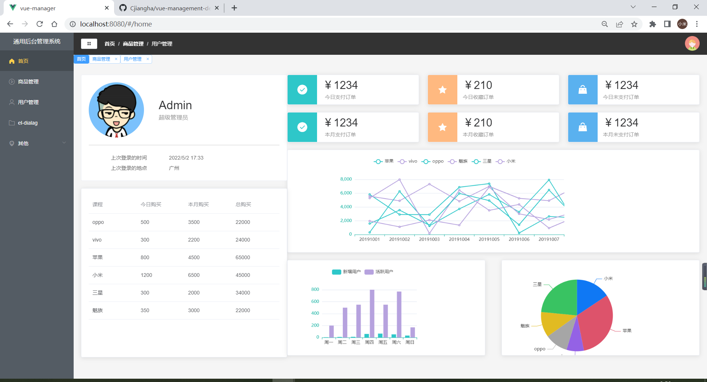

# vue-management-demo
### 功能详情

* 登录
* 后台管理页
  * 左侧导航栏
    * 多级导航栏
  * 头部
    * 面包屑
  * 用户管理
    * 个人信息模块
    * 课程模块
    * 支付订单详情模块
    * echart图标相关模块
  * 用户管理
    * 增添人员模块
    * 编辑人员模块
    * 删除人员模块
    * 搜索人员模块
  * 商品管理（可后续自行实现）
    * 课程信息模块
    * 支付订单模块
    * 购物车模块
  * 其他
    * 关于
    * xxx....

### 技术栈

vue demo . Use  Vue 2.6.11+element-UI 2.15.6+mock.js+axios

### 页面截图

* 首页 Card +  Table + ehcart

* 用户管理页面   Table+pagination、inputSearch、Dialog +Form

  

### 项目视频地址

[前端项目/vue项目实战/vue+element-ui](https://www.bilibili.com/video/BV1QU4y1E7qo?p=6)

### 踩坑记录
[踩坑记录]('./踩坑记录.md')
