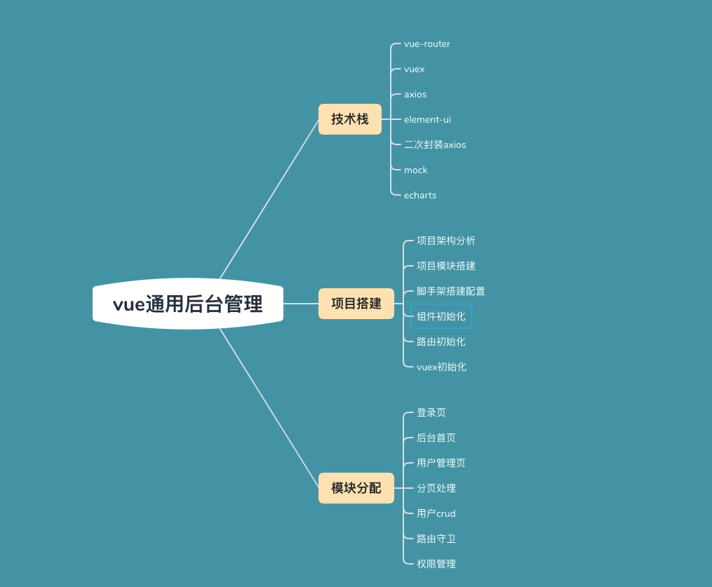
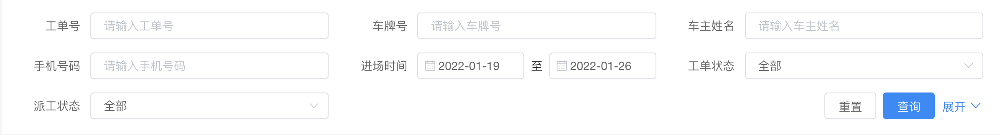
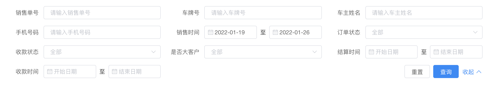

# 项目的技术栈展示 以及项目的核心重点部分


1. 项目搭建+使用element实现首页布局
2. 顶部导航菜单及与左侧导航联动的面包屑实现
3. 封装一个ECharts组件 
4. 封装一个Form表单组件和Table表格组件 
5. 企业开发之权限管理思路讲解

# 脚手架的搭建
见详细的world的文档

# element-ui的使用

- 网页直接使用

- 脚手架中使用
  - 全部引入

  - 按需引入
# 路由的使用


# 首页架子的搭建
[container的容器](https://element.eleme.cn/#/zh-CN/component/container#footer-attributes)


# 侧边栏的实现
[menu的样式](https://element.eleme.cn/#/zh-CN/component/menu#menu-group-attribute)
```js
[
        {
          path: '/',
          name: 'home',
          label: '首页',
          icon: 's-home',
          url: 'Home/Home'
        },
        {
          path: '/mall',
          name: 'mall',
          label: '商品管理',
          icon: 'video-play',
          url: 'MallManage/MallManage'
        },
        {
          path: '/user',
          name: 'user',
          label: '用户管理',
          icon: 'user',
          url: 'UserManage/UserManage'
        },
        {
          label: '其他',
          icon: 'location',
          children: [
            {
              path: '/page1',
              name: 'page1',
              label: '页面1',
              icon: 'setting',
              url: 'Other/PageOne'
            },
            {
              path: '/page2',
              name: 'page2',
              label: '页面2',
              icon: 'setting',
              url: 'Other/PageTwo'
            }
          ]
        }
      ]
```

# header组件的实现


# main组件的实现
## 左侧table的数据
```js
tableData: [
          {
            name: 'oppo',
            todayBuy: 100,
            monthBuy: 300,
            totalBuy: 800
          },
          {
            name: 'vivo',
            todayBuy: 100,
            monthBuy: 300,
            totalBuy: 800
          },
          {
            name: '苹果',
            todayBuy: 100,
            monthBuy: 300,
            totalBuy: 800
          },
          {
            name: '小米',
            todayBuy: 100,
            monthBuy: 300,
            totalBuy: 800
          },
          {
            name: '三星',
            todayBuy: 100,
            monthBuy: 300,
            totalBuy: 800
          },
          {
            name: '魅族',
           todayBuy: 100,
            monthBuy: 300,
            totalBuy: 800
          }
        ]
countData: [
        {
          name: "今日支付订单",
          value: 1234,
          icon: "success",
          color: "#2ec7c9",
        },
        {
          name: "今日收藏订单",
          value: 210,
          icon: "star-on",
          color: "#ffb980",
        },
        {
          name: "今日未支付订单",
          value: 1234,
          icon: "s-goods",
          color: "#5ab1ef",
        },
        {
          name: "本月支付订单",
          value: 1234,
          icon: "success",
          color: "#2ec7c9",
        },
        {
          name: "本月收藏订单",
          value: 210,
          icon: "star-on",
          color: "#ffb980",
        },
        {
          name: "本月未支付订单",
          value: 1234,
          icon: "s-goods",
          color: "#5ab1ef",
        },
      ],

```

```js
// mock数据模拟
import Mock from 'mockjs'

// 图表数据
let List = []
export default {
  getStatisticalData: () => {
    //Mock.Random.float 产生随机数100到8000之间 保留小数 最小0位 最大0位
    for (let i = 0; i < 7; i++) {
      List.push(
        Mock.mock({
          苹果: Mock.Random.float(100, 8000, 0, 0),
          vivo: Mock.Random.float(100, 8000, 0, 0),
          oppo: Mock.Random.float(100, 8000, 0, 0),
          魅族: Mock.Random.float(100, 8000, 0, 0),
          三星: Mock.Random.float(100, 8000, 0, 0),
          小米: Mock.Random.float(100, 8000, 0, 0)
        })
      )
    }
    return {
      code: 20000,
      data: {
        // 饼图
        videoData: [
          {
            name: '小米',
            value: 2999
          },
          {
            name: '苹果',
            value: 5999
          },
          {
            name: 'vivo',
            value: 1500
          },
          {
            name: 'oppo',
            value: 1999
          },
          {
            name: '魅族',
            value: 2200
          },
          {
            name: '三星',
            value: 4500
          }
        ],
        // 柱状图
        userData: [
          {
            date: '周一',
            new: 5,
            active: 200
          },
          {
            date: '周二',
            new: 10,
            active: 500
          },
          {
            date: '周三',
            new: 12,
            active: 550
          },
          {
            date: '周四',
            new: 60,
            active: 800
          },
          {
            date: '周五',
            new: 65,
            active: 550
          },
          {
            date: '周六',
            new: 53,
            active: 770
          },
          {
            date: '周日',
            new: 33,
            active: 170
          }
        ],
        // 折线图
        orderData: {
          date: ['20191001', '20191002', '20191003', '20191004', '20191005', '20191006', '20191007'],
          data: List
        },
        tableData: [
          {
            name: 'oppo',
            todayBuy: 500,
            monthBuy: 3500,
            totalBuy: 22000
          },
          {
            name: 'vivo',
            todayBuy: 300,
            monthBuy: 2200,
            totalBuy: 24000
          },
          {
            name: '苹果',
            todayBuy: 800,
            monthBuy: 4500,
            totalBuy: 65000
          },
          {
            name: '小米',
            todayBuy: 1200,
            monthBuy: 6500,
            totalBuy: 45000
          },
          {
            name: '三星',
            todayBuy: 300,
            monthBuy: 2000,
            totalBuy: 34000
          },
          {
            name: '魅族',
            todayBuy: 350,
            monthBuy: 3000,
            totalBuy: 22000
          }
        ]
      }
    }
  }
}


```


# echarts 的基本使用

```html
<script src="https://cdn.staticfile.org/echarts/4.3.0/echarts.min.js"></script>

```

## 订单echarts配置

```js
  order:{
    legend: {
      // 图例文字颜色
      textStyle: {
        color: "#333",
      },
    },
    grid: {
      left: "20%",
    },
    // 提示框
    tooltip: {
      trigger: "axis",
    },
    xAxis: {
      type: "category", // 类目轴
      data: [],
      axisLine: {
        lineStyle: {
          color: "#17b3a3",
        },
      },
      axisLabel: {
        interval: 0,
        color: "#333",
      },
    },
    yAxis: [
      {
        type: "value",
        axisLine: {
          lineStyle: {
            color: "#17b3a3",
          },
        },
      },
    ],
    color: ["#2ec7c9", "#b6a2de", "#5ab1ef", "#ffb980", "#d87a80", "#8d98b3"],
    series: [],
  },
```

## 用户配置
```js
user: {
          legend: {
            // 图例文字颜色
            textStyle: {
              color: "#333",
            },
          },
          grid: {
            left: "20%",
          },
          // 提示框
          tooltip: {
            trigger: "axis",
          },
          xAxis: {
            type: "category", // 类目轴
            data: [],
            axisLine: {
              lineStyle: {
                color: "#17b3a3",
              },
            },
            axisLabel: {
              interval: 0,
              color: "#333",
            },
          },
          yAxis: [
            {
              type: "value",
              axisLine: {
                lineStyle: {
                  color: "#17b3a3",
                },
              },
            },
          ],
          color: ["#2ec7c9", "#b6a2de"],
          series: [],
        },
```

## 饼状图配置
```js
video: {
          tooltip: {
            trigger: "item",
          },
          color: [
            "#0f78f4",
            "#dd536b",
            "#9462e5",
            "#a6a6a6",
            "#e1bb22",
            "#39c362",
            "#3ed1cf",
          ],
          series: [],
        },

```

# 面包屑导航思路
面包屑是在head部分组件里,Tag标签虽然不再head部分组件里,但是它在整个管理后台系统中是会一直存在的，所以需要在Main.vue中。

这两块功能的实现,主要依赖Element-ui两个样式 Breadcrumb 面包屑 + Tag 标签


整个大致逻辑是这样的,首先是面包屑 首页 一定要存在的,接下来 侧边组件 点击某菜单,把这个数据存到vuex中，然后 头部组件 来获取vuex中这个数据并展示。


# 封装一个form表单组件 

## 简单form表单的应用

```vue
<template>
<el-form ref="form" :model="form" label-width="80px">
    <el-form-item label="姓名" >
        <el-input v-model="form.name" style="width: 195px"></el-input>
    </el-form-item>
    <el-form-item label="国籍">
        <el-select v-model="form.region" placeholder="请选择国籍">
            <el-option label="中国" value="china"></el-option>
            <el-option label="美国" value="America"></el-option>
        </el-select>
    </el-form-item>
    <el-form-item label="爱好">
        <el-checkbox-group v-model="form.type">
            <el-checkbox label="画画" name="type" ></el-checkbox>
            <el-checkbox label="吹泡泡" name="type"></el-checkbox>
            <el-checkbox label="放风筝" name="type"></el-checkbox>
            <el-checkbox label="看佩琦" name="type"></el-checkbox>
        </el-checkbox-group>
    </el-form-item>
    <el-form-item>
        <el-button type="primary" @click="onSubmit" size="small">立即创建</el-button>
    </el-form-item>
</el-form>
</template>
<script>
    export default {
        data() {
            return {
                form: {
                    name: '',
                    region: '',
                    type: []
                }
            }
        },
        methods: {
            onSubmit() {
                console.log('提交 -> ' + this.form.name + " " + this.form.region + " " + this.form.type );
            }
        }
    }
</script>

```


## 我们看一下现在项目中的form表单的组件




## 看了这个以后大家可以来想一想怎么做封装 
想的过程：
这里的图片展示了两个from 表单 
两个form表单里面的item类型都不一样
假设现在我们有一个封装好的commonFrom组件 那么这两个form表单的值应该是通过属性传递过来的 那么这里在传递的时候就有两份值 并且每一份值都不一样 这个时候传递的数据结构是什么样的你能想象的到吗？

应该是 数组里面套对象 每个对象的类型都不一样 那么每个对象里面的类型对应的就是form item的类型

也就是说我们label对应的数据 待会是要传过来的 
那么我们设计这一部分的传过来的值是 这种类型的 
```js
[
  {
      label: '姓名',
      type: 'input'
  },
  {
      label: '年龄',
      type: 'input'
  },
]

```


- 那下面我们来写代码
commonForm.vue
```vue
  <template>
  <!--是否行内表单-->
    <el-form ref="form" label-width="100px">
      <!--标签显示名称-->
      <el-form-item v-for="item in formLabel" :key="item.label" :label="item.label">
      </el-form-item>
    </el-form>
  </template>

  <script>
  export default {
    // formLabel 是标签数据
    props: {
      formLabel: Array,
    },
  };
  </script>
  <style lang="scss" scoped></style>


```
User.vue
```vue
<template>
  <div>
    <common-form :formLabel="operateFormLabel"></common-form>
  </div>
</template>
<script>
import CommonForm from "../../components/CommonFrom.vue";
export default {
  components: {
    CommonForm,
  },
  data() {
    return {
      operateFormLabel: [
        {
          label: "姓名",
          type: "input",
        },
        {
          label: "年龄",
          type: "input",
        },
      ],
    };
  },
};
</script>
```

此时可以看到遍历出来了但是没有表单的类型 也就是input 框 select框这些 那么理所当然能都想到 刚刚传过来的值里面有type所以 根据type判断 那么就有了

CommonFrom.vue
```vue
<template>
  <!--是否行内表单-->
  <el-form ref="form" label-width="100px">
    <!--标签显示名称-->
    <el-form-item v-for="item in formLabel" :key="item.label" :label="item.label">
      <!--根据type来显示是什么标签-->
      <el-input
        :placeholder="'请输入' + item.label"
        v-if="item.type === 'input'"
      ></el-input>
      <el-switch v-if="item.type === 'switch'"></el-switch>
      <el-date-picker
        type="date"
        placeholder="选择日期"
        v-if="item.type === 'date'"
        value-format="yyyy-MM-dd"
      >
      </el-date-picker>
      
    </el-form-item>
  </el-form>
</template>
```
- 继续想一下 如果是select 肯定有 options 是需要遍历的 那么就会多套一层数据结构
```vue
  
    <el-select  placeholder="请选择" v-if="item.type === 'select'">
          <!--如果是select或者checkbox 、Radio就还需要选项信息-->
        <el-option v-for="item in item.opts" :key="item.value" :label="item.label" :value="item.value"></el-option>
    </el-select>

```

此时我们考虑完了 type 接下来的就是表单双向绑定的值 应该怎么处理？
肯定也是传过来 
父组件 传过来 值的类型依然是对象 
```js User.vue
   data() {
    return {
      operateFormLabel: [
        {
          label: "姓名",
          type: "input",
        },
        {
          label: "年龄",
          type: "input",
        },
      ],
      operateForm: {
        name: "",
        addr: "",
        age: "",
        birth: "",
        sex: "",
      },
    };
  },

```

```js CommonForm.vue
  export default {
    // formLabel 是标签数据
    // form是表单数据
    props: {
      formLabel: Array,
      form: Object,
    },
  };


```

- 注意：在el-form上面 受:model控制所以
```js
<el-form ref="form" label-width="100px" :model="form">
</el-form>
```
思考 那么formitem上面的 v-model怎么对应起来呢 那我们在传上一个formLabel的时候 可以在对象的key值里面加一个与之对应

```js
<el-input v-model="form[item.model]" :placeholder="'请输入' + item.label" v-if="item.type==='input'"></el-input>

```
```js
operateFormLabel: [
                    {
                        model: 'name',
                        label: '姓名',
                        type: 'input'
                    },
                    {
                        model: 'age',
                        label: '年龄',
                        type: 'input'
                    },
                    {
                        model: 'sex',
                        label: '性别',
                        type: 'select',
                        opts: [
                            {
                                label: '男',
                                value: 1
                            },
                            {
                                label: '女',
                                value: 0
                            }
                        ]
                    },
                    {
                        model: 'birth',
                        label: '出生日期',
                        type: 'date'
                    },
                    {
                        model: 'addr',
                        label: '地址',
                        type: 'input'
                    }
                ],

```


## 预留一个插槽 下面的不一样的地方可以灵活的处理

```js
<el-form-item><slot></slot></el-form-item>

```

```vue
   <common-form >
        <el-button type="primary" @click="getList(searchFrom.keyword)">搜索</el-button>
      </common-form>

```

## 表单是不是一行展示


## 权限管理

1. 登录权限


2. 菜单权限


### 登录权限
我们给系统添加一个登录凭证叫"token"，这个token在登录的时候通过接口请求将用户名和密码传给后端，后端再数据库中匹配成功后返回一个凭证，前端将token缓存起来，再调用接口时传给后端验证就建立了登录权限校验

Mock数据 permission
```js
import Mock from 'mockjs'
export default {
  getMenu: config => {
    const { username, password } = JSON.parse(config.body)
    // 先判断用户是否存在
    // 判断账号和密码是否对应
    if (username === 'admin' && password === 'admin') {
      return {
        code: 20000,
        data: {
          menu: [
            {
              path: '/',
              name: 'home',
              label: '首页',
              icon: 's-home',
              url: 'home/index'
            },
            {
              path: '/mall',
              name: 'mall',
              label: '商品管理',
              icon: 'video-play',
              url: 'mall/index'
            },
            {
              path: '/user',
              name: 'user',
              label: '用户管理',
              icon: 'user',
              url: 'User/index'
            },
            {
              label: '其他',
              icon: 'location',
              children: [
                {
                  path: '/page1',
                  name: 'page1',
                  label: '页面1',
                  icon: 'setting',
                  url: 'other/pageOne'
                },
                {
                  path: '/page2',
                  name: 'page2',
                  label: '页面2',
                  icon: 'setting',
                  url: 'other/pageTwo'
                }
              ]
            }
          ],
          token: Mock.Random.guid(),
          message: '获取成功'
        }
      }
    } else if (username === 'xiaoxiao' && password === 'xiaoxiao') {
      return {
        code: 20000,
        data: {
          menu: [
            {
              path: '/',
              name: 'home',
              label: '首页',
              icon: 's-home',
              url: 'home/index'
            },
            {
              path: '/video',
              name: 'video',
              label: '商品管理',
              icon: 'video-play',
              url: 'mall/index'
            }
          ],
          token: Mock.Random.guid(),
          message: '获取成功'
        }
      }
    } else {
      return {
        code: -999,
        data: {
          message: '密码错误'
        }
      }
    }

  }
}

```