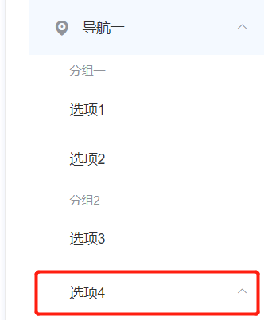
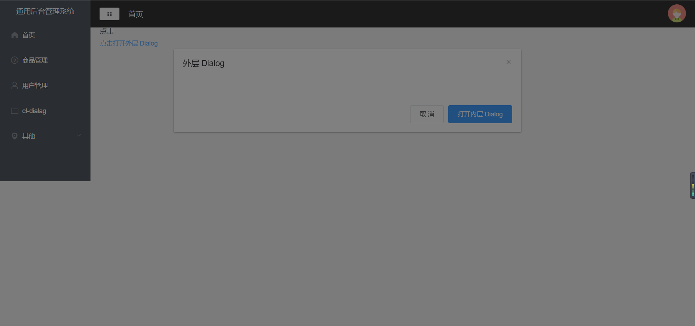

- [环境的搭建：](#环境的搭建)
- [vue 调试](#vue-调试)
- [踩坑](#踩坑)
    - [解决vue中的NavigationDuplicated {\_name: "NavigationDuplicated", name: "NavigationDuplicated"}](#解决vue中的navigationduplicated-_name-navigationduplicated-name-navigationduplicated)
- [1、element-UI 的全局引入和按需引入有什么区别](#1element-ui-的全局引入和按需引入有什么区别)
- [2、 怎么引入 Element](#2-怎么引入-element)
      - [1）、全局引入](#1全局引入)
      - [2）、按需引入](#2按需引入)
- [3、vue路由的使用 （vueRouter）](#3vue路由的使用-vuerouter)
    - [1）、NPM 包引入,这里我们使用版本@3.5.3,因为npm下载量最高是这个](#1npm-包引入这里我们使用版本353因为npm下载量最高是这个)
    - [2) 在根目录的文件夹下面，创建一个名称为router的文件夹，用于把Vue-router的实例 new VueRouter() 暴露给main.js](#2-在根目录的文件夹下面创建一个名称为router的文件夹用于把vue-router的实例-new-vuerouter-暴露给mainjs)
    - [3) 在根目录下创建一个文件夹view，用于存放我们测试的页面vue文件](#3-在根目录下创建一个文件夹view用于存放我们测试的页面vue文件)
    - [4)**Vue组件引入写法的注意事项**](#4vue组件引入写法的注意事项)
    - [5)、**相关的api**](#5相关的api)
      - [HTML](#html)
- [4、首页UI搭建](#4首页ui搭建)
    - [1)、页面布局的搭建](#1页面布局的搭建)
    - [less less-loader@5.0.0 引入](#less-less-loader500-引入)
    - [2)、左侧侧边栏的引入](#2左侧侧边栏的引入)
    - [$router](#router)
      - [$route](#route)
    - [3)、header头部的引入](#3header头部的引入)
- [5、vuex的使用（基于vue-cli脚手架）](#5vuex的使用基于vue-cli脚手架)
    - [vuex 进行修改的文件有](#vuex-进行修改的文件有)
    - [安装npm包依赖](#安装npm包依赖)
- [6、记录element-UI组件相关的坑](#6记录element-ui组件相关的坑)
    - [dialog   弹出组件的遮罩层以及多层遮罩解决办法](#dialog---弹出组件的遮罩层以及多层遮罩解决办法)
- [7、axios](#7axios)
  - [1）、基础的引入方式](#1基础的引入方式)
  - [2）、axios的二次封装](#2axios的二次封装)
- [8、mockjs](#8mockjs)
- [9、echarts](#9echarts)
    - [技术问题](#技术问题)
- [10、面包屑](#10面包屑)
- [11、router.addRoute 放的位置](#11routeraddroute-放的位置)
- [可以注释头部代码的插件koroFileHeader](#可以注释头部代码的插件korofileheader)
    - [快捷键使用](#快捷键使用)
      - [文件头部注释快捷键](#文件头部注释快捷键)
      - [函数注释注释快捷键](#函数注释注释快捷键)
      - [多行函数参数鼠标选中后函数声明后按快捷键自动提取](#多行函数参数鼠标选中后函数声明后按快捷键自动提取)
      - [函数注释光标移动到下一行，快速添加函数参数描述](#函数注释光标移动到下一行快速添加函数参数描述)
- [12、如何添加左侧的导航以及对应的路由](#12如何添加左侧的导航以及对应的路由)
- [13、解决git 小写字母命名的文件改为大写字母命名文件，提交后不生效问题](#13解决git-小写字母命名的文件改为大写字母命名文件提交后不生效问题)
# 环境的搭建：
* Vue-cli4脚手架搭建

* cnpm安装
```bash
npm install -g cnpm --registry=https://registry.npm.taobao.org
```
  输入cnpm -v，可以查看当前cnpm版本

* yarn安装
```bash
npm install -g yarn
```

  yarn是个包管理器，是facebook发布的一款取代npm的包管理工具
  //npm安装yarn

* vue-cli脚手架构建工具安装

  ```npm
  如是3.0以下
  npm install -g vue-cli@版本号
  如是3.0以上
  npm install -g @vue/cli@版本号

  cnpm同理
  查看版本号
  vue -V (注意V是大写)
  我的电脑查出来的版本号是：
  @vue/cli 4.5.11，那么默认会安装这个版本
  ```

* 创建项目
vue create 项目名称

* 安装element-UI、Vuex、axios、mock

  ```bash 
  cnpm install element-ui --D
  cnpm install vuex --D
  cnpm install axios --D
  cnpm install mock --D
  ```

  

* 启动项目
  cd xxx 
  npm run serve

* 打包项目
  - 1、npm run build
  - 2、vue UI 在图形化界面中进行打包 

* 解决打包报错  解决We‘re sorry but ... doesn‘t work properly without JavaScript enabled.
  - 1、mode类型 前端修改方式：将mode类型由history改成hash，后端修改方式：mode还是history，后端配置nginx，设置映射关系
  - 2、publicpath路径问题 publicpath需要绝对路径’/’ 
  - 3、本地开发，服务代理信息 检查代理信息是否有误，是否写有多个代理
  - 参考文章[记：解决We‘re sorry but ... doesn‘t work properly without JavaScript enabled. Please enable it to contin](https://blog.csdn.net/qq_41163341/article/details/110414490)

* Vue 关闭 eslint 语法检查
在vue项目中新建一个vue.config.js文件
打开这个文件，输入
```js
module.exports = {
lintOnSave:false
}
```
完成记得保存文件（ctrl+s），在终端中关闭项目，再重启项目（npm run serve）

# vue 调试 
```PowerShell	
  // 在项目的根目录的cmd中运行
  vue inspect > output.js 
```


# 踩坑
### 解决vue中的NavigationDuplicated {_name: "NavigationDuplicated", name: "NavigationDuplicated"}
[解决vue中的NavigationDuplicated {_name: "NavigationDuplicated", name: "NavigationDuplicated"}](https://www.jianshu.com/p/af280206d57c)

```javascript
//点击没问题 如果在这个点击页面 在点击一次router-link 就会报这个错 但是不影响功能
//去你引用vue-router的页面添加一段代码

const originalPush = Router.prototype.push
Router.prototype.push = function push(location) {
  return originalPush.call(this, location).catch(err => err)
}
//ok
//解决问题
```

# 1、element-UI 的全局引入和按需引入有什么区别

- 最大的区别：打包代码包的时候，全局引入会有很直观的感受，代码包的大小为 4M 多，
  按需引入的话，如果你只是单纯的引用部分的组件，那么代码包只有几百 KB

# 2、 怎么引入 Element

#### 1）、全局引入
你可以引入整个 Element，或是根据需要仅引入部分组件。我们先介绍如何引入完整的 Element。

npm命令
```bash
cnpm install element-ui --D
```

完整引入
在 main.js 中写入以下内容：

```js
import Vue from "vue";
import ElementUI from "element-ui";
import "element-ui/lib/theme-chalk/index.css";
import App from "./App.vue";

Vue.use(ElementUI);

new Vue({
  el: "#app",
  render: (h) => h(App),
});
```

#### 2）、按需引入
 在babel.config.js 配置文件夹下面加入代码
 ```javascript
 "plugins": [
    [
      "component",
      {
        "libraryName": "element-ui",
        "styleLibraryName": "theme-chalk"
      }
    ]
  ]
 ```
  在main.js 文件夹中,添加以下代码，这样子我们就可以愉快的使用各个组件了。

  ```js
    // 按需引入一个组件
    import {Button} from 'element-ui'
    Vue.use(Button)

    // 按需引入两个组件
     import {Button,Radio} from 'element-ui'
     Vue.use(Button)
     Vue.use(Radio)
  ```

# 3、vue路由的使用 （[vueRouter](https://router.vuejs.org/zh/guide/)）
###  1）、NPM 包引入,这里我们使用版本@3.5.3,因为npm下载量最高是这个
  ```bash
  npm install vue-router@3.5.3
  淘宝镜像
  cnpm install vue-router@3.5.3

  ```

### 2) 在根目录的文件夹下面，创建一个名称为router的文件夹，用于把Vue-router的实例 new VueRouter() 暴露给main.js
```js
// router -> index.js
import VueRouter from "vue-router";
import Vue from "vue";

const routes = [{
        path: '/',
        name: 'Main',
        component:()=>import('../view/Main.vue'),
        // component: Main,
        children: [{
                path: '/home',
                name: 'home',
                component: () =>import('../view/Home/Home.vue')
            }
        ]
    },
]

Vue.use(VueRouter)

const router = new VueRouter({
    mode: 'history',
    routes
})


export default router

```

### 3) 在根目录下创建一个文件夹view，用于存放我们测试的页面vue文件
```js
// view -> 相关的vue文件
// 使用Main.vue，对整个页面的布局进行配置

```

### 4)**Vue组件引入写法的注意事项**
* import Home from '../view/Home.vue' ,并注入compoent
* 按需引入，直接使用 component:()=>import(路径名)

### 5)、**相关的api**

#### HTML
**router-view**
router-view 将显示与 url 对应的组件。你可以把它放在任何地方，以适应你的布局。

  **props:**
  * name
  * route 


**router-link**

我们没有使用常规的 a 标签，而是使用一个自定义组件 router-link 来创建链接。这使得 Vue Router 可以在不重新加载页面的情况下更改 URL，处理 URL 的生成以及编码。

**props:**
  * to 
  * replace 
  * active-class 
  * aria-current-value 
  * custom 
  * exact-active-class


# 4、首页UI搭建
### 1)、页面布局的搭建
   在文件夹view 下的 Main.vue进行配置
   aside、header、main 在element-UI官方文档里的组件对应的是container

###  less less-loader@5.0.0 引入
```bash
cnpm install less --D
cnpm install less-loader@5.0.0 --D
```

### 2)、左侧侧边栏的引入
   [NavMenu 导航菜单](https://element.eleme.cn/#/zh-CN/component/menu) 

Menu,Submenu,MenuItem,MenuItemGroup引入在element-UI对应的官方文档是组件NavMenu导航菜单这个组件，引入方式同上。
* el-submenu
    > 在菜单中通过 submenu 组件可以生成二级菜单。
      Menu 还提供了background-color、text-color和active-text-color

    ```HTML
    <el-submenu index="1-4">
      <span slot="title">选项4</span>
      <el-menu-item index="1-4-1">选项1</el-menu-item>
    </el-submenu>
    ```
    

* el-menu-item-group
  
    > 通过el-menu-item-group组件可以实现菜单进行分组，分组名可以通过`title`属性直接设定，也可以通过具名 `slot` 来设定。
    ```HTML
     <el-menu-item-group title="分组2">
      <el-menu-item index="1-3">选项3</el-menu-item>
    </el-menu-item-group>
    ```
    
    [.png)]()
    
* el-menu-item
    普通的菜单栏的item.
    
   ```HTML
   <el-menu-item index="2">
      <i class="el-icon-menu"></i>
      <span slot="title">导航二</span>
   </el-menu-item>
   ```
     


踩坑，遇到一个一级菜单，收缩的时候，他的图标会消失的问题，以为在一级菜单下 添加了外层代码如下所示：
```HTML
   <template slot="title">
      <i class="el-icon-location"></i>
      <span slot="title">导航一</span>
    </template>
  <!-- 那么只要把template去掉后该问题就解决了 -->
```
引发思考:element-UI 下的template的具体的作用是什么呢？？（等待后续补充吧）

Invalid prop: type check failed for prop “index“. Expected String, got Undefined
出现这个报错是因为 :index 里面可能不是字符串，解决方式：
``HTML
<div :index="item.path + ''"></div>
``

[$route和$router的区别详解](https://blog.csdn.net/xunfengZ/article/details/109670979)
* 路由配置：嵌套路由，加一个children作为嵌套路由的二级路由
    $router 是用来操作路由的，$route是用来获取路由信息的。


### $router 
    $router是VueRouter的一个实例，他包含了所有的路由，包括路由的跳转方法，钩子函数等，也包含一些子对象（例如history）
常用的跳转连接的方法：

    ```javascript
    //常规方法
    this.$router.push("/login");
    //使用对象的形式 不带参数
    this.$router.push({ path:"/login" });
    //使用对象的形式，参数为地址栏上的参数
    this.$router.push({ path:"/login",query:{username:"jack"} }); 
    //使用对象的形式 ，参数为params 不会显示在地址栏
    this.$router.push({ name:'user' , params: {id:123} });
    ```
  #### $route
    $ route是一个跳转的路由对象（路由信息对象），每一个路由都会有一个$route对象，是一个局部的对象。
    
    主要的属性有：
    $route.path 字符串，等于当前路由对象的路径，会被解析为绝对路径，如/home/ews
    $route.params 对象，包含路由中的动态片段和全匹配片段的键值对，不会拼接到路由的url后面 
    $route.query 对象，包含路由中查询参数的键值对。会拼接到路由url后面
    $route.router 路由规则所属的路由器 
    $route.name 当前路由的名字，如果没有使用具体路径，则名字为空

### 3)、header头部的引入
   需要用到的标签以及组件 
   * header
   * el-button 作为菜单的按钮
   * h3  面包屑的文字
   * el-dropdown
   * el-dropdown-menu
   * el-dropdown-item

   css 引入作者写好的 less文件作为引入

# 5、vuex的使用（基于vue-cli脚手架）

### vuex 进行修改的文件有
* src->main.js           //在main.js下进行store的注入
* store->index.js   //维护的仓库
         tab.js     //所定义的tab所对应修改的state,会讲暴露的tab传递到index下的modules


 vue 使用import之后就会报Object(...) is not a function的错
 "vuex": "^4.0.2"
 [兄弟的项目](https://github.com/buxianshan/vue-management-demo/blob/master/package.json)
 看了b站其他人开源的项目 vuex的版本是:"vuex": "^3.6.2"

  **搭配方式**
  看了下npm各个包的下载量适配度最高如下
  "vue": "^2.6.14","vue-router": "^3.5.3", "vuex": "^3.6.2",
  然后我用的  vue-cli版本是4.5.11

```js
// index.js
import Vue from 'vue'
import Vuex from 'vuex'
import tab from './tab.js'

Vue.use(Vuex)

export default new Vuex.Store({
    modules:{
        tab
    }
})
```

```js
// tab.js
export default{
    states:{
        isCollapse:false
    },
    mutations:{
        collapsemenu(state){
            state.isCollapse = !state.isCollapse
        }
    }
}
```

```js
//main.js
import store from '../store'

new Vue({
  store,//使用store
  router,
  render: (h) => h(App),
}).$mount("#app");
```


比较友好入门的文章
[vuex最简单、最详细的入门文档](https://blog.csdn.net/zwhfyy/article/details/123416249)

### 安装npm包依赖
```bash
  npm install vuex 
  cnpm install vuex 
```

# 6、记录element-UI组件相关的坑
  ###  dialog   弹出组件的遮罩层以及多层遮罩解决办法
 >  涉及到 dialog组件的两个属性 append-to-body 和 modal-append-to-body
    涉及到两层的dialog 我的解决方法就是在每个dialog组件下面增加属性值 append-to-body即可



> el-dropdown-item 下的点击事件要使用  @click.native="quit"  click后面要加 native


思考过程：
现在想做的事情就是在左侧menu的下方再加一个menu。
思考下需要修改的文件？
第一步 第二步 第三步 第四步
1、menu是怎么写出来的，然后对menu进行添加 新的一行menu
   main.vue -> commonAsside   
               commonAsside 下有一段 data的数据，如果是后端返回的应该就是后端返回这段数据，再根据这段
                             JSON去调用 $router.push方法，根据该item进行匹配到对应的路由的name


思路：menu是由数据组成，Html模板渲染，所以是在左边的menu的data层加入数据，并且给路由配置一个组件，这个组件配置完可以对应的点击后进入到右侧的相关的面包屑的页面

# 7、axios
如何安装？
```bash
cnpm install axios --D
```

vue-cli项目下 如何引入

## 1）、基础的引入方式
```js
  // main.js
  import http from 'axios'
  Vue.prototype.$http = http

 // xxx.vue，写在mounted中。
 this.$http.get('/user?ID=12345')
  .then(function (response) {
    console.log(response);
  })
  .catch(function (error) {
    console.log(error);
  });
```

## 2）、axios的二次封装
[axios中文文档|axios中文网](http://www.axios-js.com/zh-cn/docs/)

涉及到的概念：
Axios是什么？
Axios 是一个基于 promise 的 HTTP 库，可以用在浏览器和 node.js 中。

特性
- 从浏览器中创建 XMLHttpRequests
- 从 node.js 创建 http 请求
- 支持 Promise API
- 拦截请求和响应
- 转换请求数据和响应数据
- 取消请求
- 自动转换 JSON 数据
- 客户端支持防御 XSRF


```js
// api -> axios
import axios from 'axios'
import config from '../config'

const baseUrl = process.env.NODE_ENV === 'development' ? config.baseUrl.dev : config.baseUrl.pro

class HttpRequest {
    constructor(baseUrl) {
        this.baseUrl = baseUrl
    }
    getInsideConfig() {
        const config = {
            baseUrl: this.baseUrl,
            Headers: {}
        }
    }
    instencepotors(instance) {
        // 添加请求拦截器
        instance.interceptors.request.use(function (config) {
            // 在发送请求之前做些什么
            return config;
        }, function (error) {
            // 对请求错误做些什么
            return Promise.reject(error);
        });

        // 添加响应拦截器
        instance.interceptors.response.use(function (response) {
            // 对响应数据做点什么
            return response;
        }, function (error) {
            // 对响应错误做点什么
            return Promise.reject(error);
        });
    }
    // 看着像闭包
    request(option){
        const instance = axios.create()
        options = {...this.getInsideConfig(),...option}
        this.instencepotors(instance) // 调用拦截器
        return instance(options)
    }
}
export default new HttpRequest(baseUrl)

// config -> index.js
export default {
    baseUrl:{
        //开发环境
        dev:'/api/',
        //生产环境
        pro:''
    }
}

// api -> data.js 
import axios from "./axios"; // 引入axios.js文件夹下的内容
export const getMenu = (param)=>{
    return axios.request({
        url:'/permission/getMenu',
        methods:'post',
        data:param
    })
}
```
问题：在页面中引入了 
import getMenu from '../../api/data.js' 会出现报错 ： "TypeError: Object(...) is not a function"
原因：导入的JS文件没有用大括号接收，然后又把它当做方法调用了
参考文章：[vue报错：TypeError: Object(...) is not a function](https://blog.csdn.net/yingleiming/article/details/106944433)

# 8、mockjs
[mockjs](http://mockjs.com/examples.html)
安装
```bash
cnpm install mockjs --D
```

```js
// api -> mock.js
import Mock from 'mockjs'
import homeApi from './mockServerData/home.js'

Mock.mock('/home/getData',homeApi.getStatisticalData)

// mockServerData -> home.js,导入相应的数据，有对应的 return的值。
```

# 9、echarts
安装
```npm
<!-- 看了下 npm下的echarts的version，最高的下载量是 4.9.0 ，但是这个课程的老师用的是 5.1.2-->
所以使用以下的命令：
cnpm install echats@4.9.0 --D
```

### [技术问题](https://echarts.apache.org/handbook/zh/basics/help/)
确保现有文档等资料无法解决你的问题
ECharts 有非常大量的用户，所以你遇到过的问题很可能别人在此之前也遇到并解决了。通过查看文档以及使用搜索引擎搜索关键字，可以帮助你自助地在第一时间解决问题，而不需要依赖社区的帮助。

因此，在做其他操作前，请确保现有文档等资料无法解决你的问题。可以尝试查看或搜索的资料包括：

* [API](https://echarts.apache.org/zh/api.html#echarts)
* [配置项手册](https://echarts.apache.org/zh/option.html)：可以尝试使用搜索功能
* 本手册的文章
* (常见问题)[https://echarts.apache.org/zh/faq.html]
* (在 GitHub issue 中搜索关键字)[https://github.com/apache/echarts/issues]
* 使用搜索引擎搜索关键字


[堆叠折线图](https://echarts.apache.org/handbook/zh/how-to/chart-types/line/stacked-line/#%E5%A0%86%E5%8F%A0%E6%8A%98%E7%BA%BF%E5%9B%BE)


# 10、面包屑
路由

# 11、router.addRoute 放的位置
  导航页面跳转的时候，路由跳转会出现白屏的情况，
  这是因为，`addRoute`在事件中要触发，同时需要在生命周期中触发，
  ```js
  // login.vue 的登录按钮下触发
    this.$store.commit("addMenu", this.$router); // router 组件注册
  // Main.vue 组件中触发 或者在全局 main.js触发
    this.$store.commit("addMenu", this.$router); // router 组件注册
  ```


# 可以注释头部代码的插件[koroFileHeader](https://marketplace.visualstudio.com/items?itemName=OBKoro1.korofileheader)
### 快捷键使用

#### 文件头部注释快捷键

- 记录文件信息/文件的传参/出参，设置个性签名、留下QQ、微信联系方式、输入空行等等
- 支持用户高度自定义注释选项, 适配各种需求的注释形式。
- 保存文件的时候，自动更新最后的编辑时间和编辑人
- `window`：`ctrl+win+i`,`mac`：`ctrl+cmd+i`, `linux`: `ctrl+meta+i`,`Ubuntu`: `ctrl+super+i`

#### 函数注释注释快捷键

> 更多关于函数参数自动请查阅[配置-函数注释自动提取函数的参数](https://github.com/OBKoro1/koro1FileHeader/wiki/配置#函数注释自动提取函数的参数)文档

- 将光标放在函数行或者将光标放在函数上方的空白行。
- 自动解析函数参数，生成函数参数注释。
- 快捷键：`window`：`ctrl+win+t`,`mac`：`ctrl+cmd+t`,`linux`: `ctrl+meta+t`, `Ubuntu`: `ctrl+super+t`

#### 多行函数参数鼠标选中后函数声明后按快捷键自动提取

1. **鼠标左键选择多行函数声明区域，函数声明区域尽量精准**
2. **按函数注释快捷键**


#### 函数注释光标移动到下一行，快速添加函数参数描述

```
window`: `win+y`, mac: `cmd+y`, linux: `meta+y
```

生成函数注释之后，使用快捷键移动鼠标到下一行，快速为函数参数添加描述。

可能有很多参数，需要移动鼠标一个一个添加的话，操作起来有点麻烦。


# 12、如何添加左侧的导航以及对应的路由
这个项目的路由功能是通过Mock 返回 menu 数据，然后把数据存入vuex 的 state里面，然后通过 vuex 的 setMenu方法，传入val值后把对应的 给左侧的导航进行渲染，
还有定义了一个方法 getMenu对route进行导入。所以 我们可以在文件`api/mockServerData/permission.js`下面的 `getMenu`方法，对相应的路由进行配置
具体 按 ctrl + p 查找`api/mockServerData/permission.js` 找到对应的文件后，进行路由及导航的添加即可。

# 13、解决git 小写字母命名的文件改为大写字母命名文件，提交后不生效问题
```bash
  1.使用git命令
  关掉git的大小写默认设置：git config core.ignorecase false
  2、先从git删除对应文件，再把更改后的文件提交上去
```


